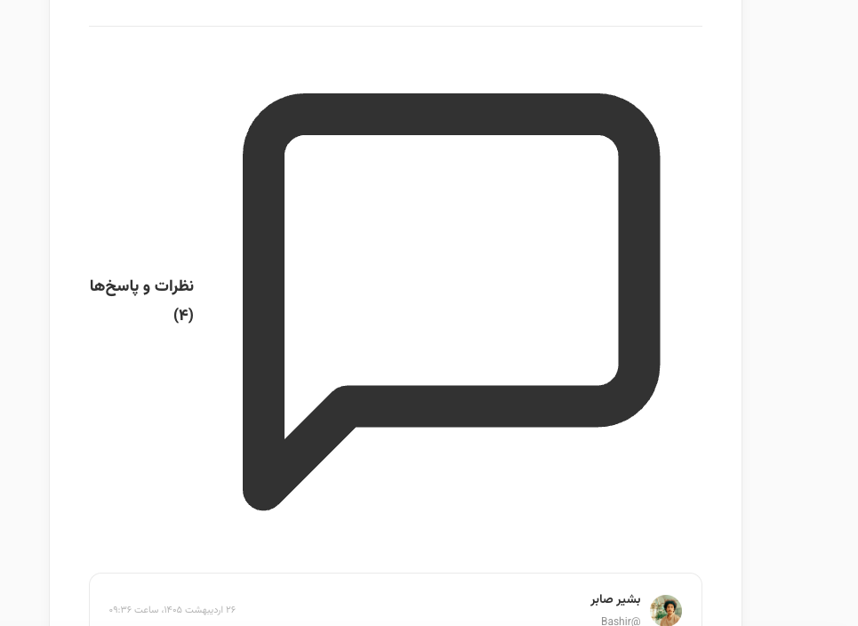
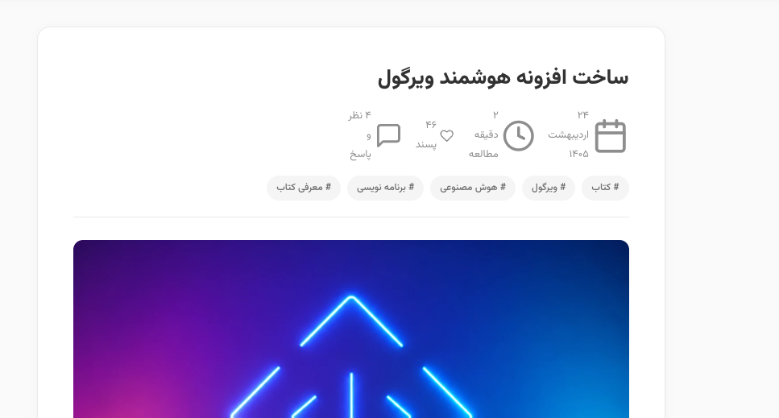
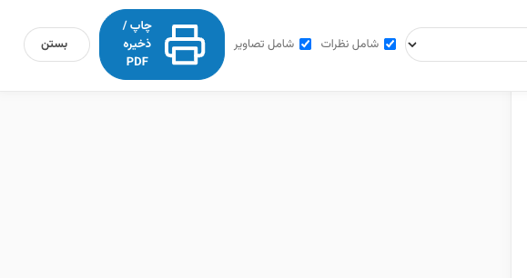

# ویرگول بک‌آپ (Virgool Backup)

<p align="center">
  
</p>

<p align="center">
  <b>افزونه حرفه‌ای، متن‌باز و مدرن گوگل کروم جهت استخراج، بایگانی آفلاین و تهیه پشتیبان کامل از مقالات، تصاویر، فایل‌های صوتی و زنجیره نظرات تو در توی کاربران در ویرگول (Virgool.io)</b>
</p>

<p align="center">
  <a href="https://github.com/EhsanShahbazii"></a>
  <a href="https://github.com/EhsanShahbazii/virgool-backup"></a>
  
  
  
</p>

---

## فهرست مطالب
- [معرفی افزونه](#معرفی-افزونه)
- [تصاویر محیط افزونه](#تصاویر-محیط-افزونه)
- [قابلیت‌ها و امکانات برجسته](#قابلیت‌ها-و-امکانات-برجسته)
- [اسلایدر تنظیم سرعت و پردازشگرها](#اسلایدر-تنظیم-سرعت-و-پردازشگرها)
- [راهنمای نصب و راه‌اندازی](#راهنمای-نصب-و-راه‌اندازی)
- [راهنمای استفاده](#راهنمای-استفاده)
- [فرمت‌های خروجی](#فرمت‌های-خروجی)
- [معماری و ساختار پروژه](#معماری-و-ساختار-پروژه)
- [توسعه‌دهنده و راه‌های ارتباطی](#توسعه‌دهنده-و-راه‌های-ارتباطی)
- [لایسنس](#لایسنس)

---

## معرفی افزونه

**ویرگول بک‌آپ (Virgool Backup)** ابزاری قدرتمند و بدون وابستگی به سرور واسط است که مستقیماً در مرورگر کروم اجرا شده و به نویسندگان، محققان و خوانندگان ویرگول اجازه می‌دهد تمام آثار منتشر شده‌ی هر حساب کاربری را همراه با تمام جزئیات، تصاویر باکیفیت اصلی، متادیتا، پیوند پادکست‌ها و تمام پاسخ‌های تو در توی نظرات دریافت و در قالب‌های شکیل و کاربردی ذخیره کنند.

این افزونه با در نظر گرفتن چالش‌هایی نظیر محدودیت‌های نرخ درخواست (Rate Limiting)، ساختارهای پیچیده نظرات تو در تو، استانداردهای پرینت و صفحه‌آرایی فارسی (RTL) به صورت اختصاصی با زبان JavaScript خالص (بدون فریم‌ورک‌های سنگین) بر پایه Manifest V3 پیاده‌سازی شده است.

---

## تصاویر محیط افزونه

<div align="center">

### ۱. پنجره اصلی افزونه (Popup) با شناسایی خودکار نویسنده و اسلایدر تنظیم سرعت

*(تصویر پیش‌فرض: `screenshots/Screenshot 1405-06-22 at 08.46.17.png`)*

<br>

### ۲. داشبورد مدیریت و تاریخچه پشتیبان‌ها (Manager Dashboard)

*(تصویر پیش‌فرض: `screenshots/Screenshot 1405-06-22 at 08.46.24.png`)*

<br>

### ۳. انتخاب چندگانه مقالات (Multi-Select) برای خروجی دسته‌جمعی

*(تصویر پیش‌فرض: `screenshots/Screenshot 1405-06-22 at 08.46.38.png`)*

<br>

### ۴. مدال تایید حذف ایمن نسخه پشتیبان

*(تصویر پیش‌فرض: `screenshots/Screenshot 1405-06-22 at 08.49.25.png`)*

<br>

### ۵. خروجی چاپی و PDF استاندارد فارسی (با صفحه جلد و بدون هدر/فوتر مزاحم)


</div>

> **نکته:** اسکرین‌شات‌ها در پوشه `screenshots/` قرار دارند و می‌توانید تصاویر دلخواه خود را با همین نام‌ها جایگزین یا اضافه نمایید.

---

## قابلیت‌ها و امکانات برجسته

### ۱. سیستم هوشمند تلاش مجدد (Smart Retry & Exponential Backoff)
- در صورت مواجهه با محدودیت نرخ درخواست (خطای HTTP 429)، خطاهای موقت سرور (5xx) یا نوسانات شبکه، سیستم به صورت خودکار با تاخیر تصاعدی (`1s`، `2s`، `4s` و ...) درخواست را مجدداً ارسال می‌کند و مانع از متوقف شدن فرآیند پشتیبان‌گیری می‌شود.

### ۲. چرخش تصادفی هویت مرورگر (Random User-Agent Rotation)
- برای جلوگیری از رفتارهای غیرمعمول شبکه، درخواست‌های ارسالی به طور خودکار از میان هدرهای مرورگرهای معتبر (Chrome، Safari، Firefox و Edge) انتخاب و ارسال می‌شوند.

### ۳. اسلایدر شکیل کنترل سرعت و پردازشگرها (Speed & Worker Slider)
- طراحی کامپوننت اسلایدر کاملاً مطابق با سبک بصری ویرگول (تایپوگرافی وزیرمتن، بج‌های نشانگر ریسک، رنگ‌بندی گرادیان و بدون ایموجی).
- انتخاب بین ۱ پردازشگر (تک‌ترد با تاخیر ۰.۰۵ ثانیه و بدون هیچ‌گونه ریسک لیمیت) تا ۸ پردازشگر همزمان (با تاخیر ۰.۲ ثانیه برای حداکثر سرعت).
- ذخیره‌سازی خودکار تنظیمات انتخابی کاربر برای استفاده‌های بعدی.

### ۴. استخراج کامل درخت نظرات و پاسخ‌ها (Recursive Nested Comments)
- بازیابی تمام سطوح پاسخ‌ها (Replies) به صورت بازگشتی و عمیق بدون از دست رفتن حتی یک دیدگاه یا پاسخ تو در تو.
- نمایش تعداد لایک‌ها، تاریخ شمسی، نام نویسنده و آواتار برای هر دیدگاه.

### ۵. خروجی PDF بدون نقص و کتابچه‌ای (Booklet PDF)
- صفحه جلد اختصاصی با عکس پروفایل نویسنده (یا آواتار رسمی ویرگول)، بیوگرافی و جدول آمار کل مقالات و نظرات.
- حذف کامل آدرس لینک‌ها و متون اضافی در هدر و فوتر مرورگر هنگام پرینت.
- بارگذاری خودکار و پیش‌فچ کامل تمام تصاویر مقالات بدون نیاز به اسکرول دستی قبل از ذخیره PDF.
- راست‌چین کامل (RTL) با فونت استاندارد Vazirmatn و جلوگیری از برش نامناسب کدها و جداول در شکست صفحات.

### ۶. انتخاب چندگانه مقالات (Multi-Select Export)
- امکان تیک زدن و انتخاب چندین مقاله خاص از میان مقالات نویسنده و دریافت خروجی PDF یا JSON تنها از موارد انتخاب‌شده.

### ۷. داشبورد مدیریت و بایگانی جامع (Manager)
- ذخیره‌سازی نامحدود بک‌آپ‌ها در IndexedDB محلی مرورگر.
- سایدبار تاریخچه نویسندگان همراه با متادیتا و تفکیک خودکار نام‌های کاربری تکراری با برچسب‌های نسخه‌بندی (`v2`، `v3` و ...).
- مدال تایید حذف ایمن با پرسش نام نویسنده برای جلوگیری از حذف تصادفی آرشیوها.
- جستجوی سریع و زنده در عنوان و برچسب‌های مقالات.
- گزینه‌های متنوع تعداد نمایش در صفحه (۸، ۱۶، ۲۴، ۴۸ و ۹۶ مقاله).

---

## اسلایدر تنظیم سرعت و پردازشگرها

جدول تنظیمات اسلایدر بر اساس نیاز کاربر:

| گام اسلایدر | تعداد کارگر همزمان (Workers) | تاخیر بین درخواست‌ها (Delay) | سطح ریسک محدودیت | کاربرد پیشنهادی |
| :---: | :---: | :---: | :---: | :--- |
| **۱ (پیش‌فرض)** | **۱ ترد (Single Thread)** | **۰.۰۵ ثانیه (۵۰ms)** | 🟢 بسیار کم | کاربران خانگی با اینترنت معمولی و بدون عجله |
| **۲** | ۲ پردازشگر | ۰.۰۷ ثانیه | 🟢 بسیار کم | سرعت پایدار و مطمئن |
| **۳** | ۳ پردازشگر | ۰.۰۹ ثانیه | 🟡 متعادل | سرعت خوب برای اکانت‌های پرمقاله |
| **۴** | ۴ پردازشگر | ۰.۱۱ ثانیه | 🟡 متوسط | تعادل میان کارایی و مصرف منابع |
| **۵** | ۵ پردازشگر | ۰.۱۳ ثانیه | 🟡 ملایم | مناسب کانکشن‌های سریع |
| **۶** | ۶ پردازشگر | ۰.۱۵ ثانیه | 🔴 نسبتاً بالا | سرعت بالا |
| **۷** | ۷ پردازشگر | ۰.۱۸ ثانیه | 🔴 بالا | کاربرد حرفه‌ای |
| **۸** | ۸ پردازشگر | ۰.۲ ثانیه (۲۰۰ms) | 🔴 بالا (توربو) | حداکثر سرعت استخراج در کمترین زمان ممکن |

---

## راهنمای نصب و راه‌اندازی

برای نصب افزونه در مرورگرهای **گوگل کروم (Google Chrome)**، **بریو (Brave)**، **مایکروسافت اج (Microsoft Edge)** یا سایر مرورگرهای مبتنی بر Chromium:

1. این مخزن را دانلود کرده یا با دستور زیر کلون کنید:
   ```bash
   git clone https://github.com/EhsanShahbazii/virgool-backup.git
   ```
2. در نوار آدرس مرورگر خود وارد بخش مدیریت افزونه‌ها شوید:
   ```text
   chrome://extensions/
   ```
3. گزینه **Developer mode (حالت توسعه‌دهنده)** را در گوشه بالا سمت راست (یا چپ) فعال نمایید.
4. بر روی دکمه **Load unpacked (بارگذاری بسته بازنشده)** کلیک کنید.
5. پوشه اصلی پروژه (`virgool-backup`) را انتخاب نمایید.
6. افزونه نصب شد! پیشنهاد می‌شود برای دسترسی سریع‌تر، آیکون آن را در نوار ابزار بالای مرورگر پین کنید.

---

## راهنمای استفاده

1. وارد سایت **ویرگول** و صفحه پروفایل یا یکی از مقالات نویسنده مورد نظر شوید (مثلاً `https://virgool.io/@ehsanshahbazii`).
2. بر روی آیکون افزونه در نوار ابزار مرورگر کلیک کنید؛ نام کاربری نویسنده به صورت خودکار شناسایی و درج می‌شود.
3. در صورت تمایل، اسلایدر سرعت و تعداد پردازشگرها را تنظیم کنید.
4. روی دکمه **شروع پشتیبان‌گیری کامل** کلیک کنید.
5. وضعیت پیشرفت، تعداد مقالات و نظرات استخراج‌شده به صورت زنده نمایش داده می‌شود.
6. پس از اتمام، می‌توانید بلافاصله فایل **JSON** را دریافت کرده یا با زدن دکمه **چاپ و خروجی PDF**، کتابچه کامل مقالات را مشاهده و چاپ نمایید.
7. با کلیک روی دکمه **داشبورد مدیریت مقالات**، به آرشیو تمام پشتیبان‌های گذشته و امکانات پیشرفته فیلتر و انتخاب چندگانه دسترسی خواهید داشت.

---

## فرمت‌های خروجی

- **خروجی PDF چاپی (Print / PDF Export):**
  کتابچه کامل با جلد سفارشی، صفحه اختصاصی هر مقاله، فونت استاندارد وزیرمتن، حفظ چینش کدها و نقل‌قول‌ها و درخت کامل نظرات.
- **خروجی صفحات HTML مستقل و آفلاین (Standalone HTML Export):**
  امکان ذخیره و دانلود کل مقالات، مقالات انتخاب‌شده به صورت دسته‌جمعی، یا هر مقاله به صورت فایل تک‌برگی `.html` مستقل، واکنش‌گرا و آفلاین؛ همراه با فهرست تعاملی مطالب (TOC)، استایل‌های چشم‌نواز ویرگول، فونت وزیرمتن، کدهای برنامه‌نویسی و درخت کامل نظرات بدون نیاز به هیچ ابزار واسط یا اینترنت.
- **خروجی داده ساختاریافته (JSON Export):**
  فرمت استاندارد شامل اطلاعات کاربر، لیست کامل مقالات با محتوای ساختاریافته (تگ‌ها، عناوین، متن پاراگراف‌ها، تصاویر، لینک‌های صوتی) و درخت سلسله‌مراتبی نظرات برای ادغام با دیگر برنامه‌ها یا انتقال به وردپرس، گیت‌هاب و وبلاگ شخصی.

---

## معماری و ساختار پروژه

```text
virgool-backup/
├── manifest.json              # مانیفست استاندارد Manifest V3
├── assets/
│   └── icons/                 # آیکون‌های وکتوری رسمی در ابعاد مختلف (16, 32, 48, 128)
├── background/
│   └── service-worker.js      # سرویس‌ورکر پس‌زمینه مرورگر
├── content/
│   └── content-script.js      # کانتنت اسکریپت شناسایی خودکار پروفایل نویسنده در ویرگول
├── popup/
│   ├── popup.html             # رابط کاربری پاپ‌آپ سریع
│   ├── popup.css              # استایل‌های مدرن بر پایه دیزاین سیستم ویرگول
│   └── popup.js               # کنترلر پاپ‌آپ، نوار پیشرفت و تنظیم سرعت
├── manager/
│   ├── manager.html           # داشبورد کامل مدیریت و بایگانی پشتیبان‌ها
│   ├── manager.css            # استایل‌های ریسپانسیو داشبورد، سایدبار و گرید مقالات
│   └── manager.js             # منطق سایدبار، جستجو، صفحه‌بندی و انتخاب چندگانه
├── print/
│   ├── print.html             # قالب اختصاصی چاپ و موتور تبدیل مقالات به کتابچه
│   ├── print.css              # استایل‌های چاپ اختصاصی @media print با فونت وزیرمتن
│   └── print.js               # رندر بهینه، پیش‌فچ تصاویر و مدیریت رویدادهای پرینت
├── lib/
│   ├── virgool-api.js         # ماژول ارتباط با API، سیستم ریتری و استخر پردازشگرها
│   ├── body-parser.js         # پارسر متن، رسانه و استخراج ساختار مقالات
│   ├── storage.js             # پایگاه‌داده محلی با IndexedDB برای نگهداری دائمی آرشیوها
│   ├── date-utils.js          # تبدیل تاریخ شمسی و اعداد فارسی
│   └── exporters/
│       ├── json-exporter.js   # صادرکننده ساختاریافته JSON
│       └── html-exporter.js   # صادرکننده صفحات وب مستقل و آفلاین HTML
├── screenshots/               # تصاویر و اسکرین‌شات‌های مستندات افزونه
└── test/
    ├── test_backup_flow.py    # تست یکپارچگی استخراج API و ساختار پکیج پشتیبان
    └── test_recursive_comments.py # تست استخراج بازگشتی نظرات تو در تو
```

---

## توسعه‌دهنده و راه‌های ارتباطی

توسعه‌داده‌شده با افتخار توسط **احسان شهبازی (Ehsan Shahbazi)**  
- 🌐 پروفایل گیت‌هاب: [https://github.com/EhsanShahbazii](https://github.com/EhsanShahbazii)  
- 📦 مخزن پروژه: [https://github.com/EhsanShahbazii/virgool-backup](https://github.com/EhsanShahbazii/virgool-backup)  

در صورت داشتن هرگونه پیشنهاد، گزارش باگ یا تمایل به مشارکت در توسعه، خوشحال می‌شویم در بخش Issues یا Pull Requests گیت‌هاب با ما در ارتباط باشید.

---

## لایسنس

این پروژه تحت مجوز **[MIT License](LICENSE)** به صورت کاملاً آزاد و متن‌باز منتشر شده است. استفاده، ویرایش و توسعه آن با ذکر نام توسعه‌دهنده بلامانع است.
